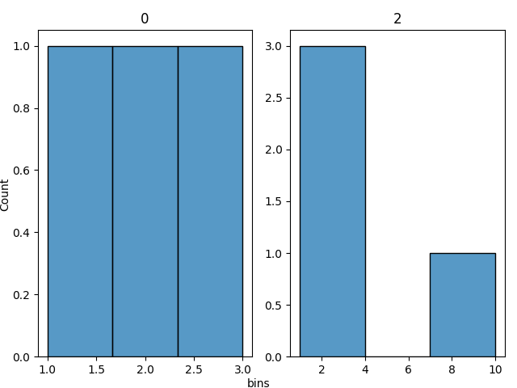

.. _reports:

Graphs
******

Graph Your Data
===============

We can plot some of our data as seaborn histogram plots. Below will demonstrate how to do so and provide examples.

The following plots are currently available to work directly with your profilers:

 * histogram (numeric columns only)

Below shows how to do so with examples.

What we need to import
~~~~~~~~~~~~~~~~~~~~~~
.. code-block:: python

    from dataprofiler.reports import graphs

The main functions that is used to plot histograms are in graphs. **You will also need the `dataprofiler[reports]` requirement to be installed**:

.. code-block:: console

    pip install 'dataprofiler[reports]'

Plotting from a StructuredProfiler class
~~~~~~~~~~~~~~~~~~~~~~~~~~~~~~~~~~~~~~~~

With a StructuredProfiler class variable, we can specify what columns we want to be plotted, and plot them into histograms.

.. code-block:: python

    graphs.plot_histograms(profiler, columns)

These are what the variables mean:

    * **profiler** - StructuredProfiler class variable that contains the data we want
    * **columns** - (Optional) The list of IntColumn or FloatColumn we want to specifically plot.

Plotting an individual IntColumn or FloatColumn
~~~~~~~~~~~~~~~~~~~~~~~~~~~~~~~~~~~~~~~~~~~~~~~

Example uses a CSV file for example, but CSV, JSON, Avro or Parquet should also work.

.. code-block:: python

    graphs.plot_col_histogram(column, axes, title)

These are what the variables mean:

    * **column** - The IntColumn or FloatColumn we want to plot
    * **axes** - (Optional) The axes we want to specify.
    * **title** - (Optional) The title of the plot we want to define.

Examples
~~~~~~~~

1. This example demonstrates how we can take a StructuredProfiler class and plot histograms of the specified columns.

.. code-block:: python

    import dataprofiler as dp
    from dataprofiler.reports import graphs
    

    data = [[1, 'a', 1.0],
            [2, 'b', 2.2],
            [3, 'c', 3.5],
            [None, 'd', 10.0]]
    profiler = dp.StructuredProfiler(data)

    # This will plot all IntColumn and FloatColumn as histograms (The first and last column).
    fig = graphs.plot_histograms(profiler)
    fig.show()

    # This will only plot the specified column, 0.
    columns = [0]
    fig = graphs.plot_histograms(profiler, columns)
    fig.show()

.. image:: _static/images/histogram_example_1.png
    :alt: Second Histogram Example Image

2. This example demonstrates how we can plot a low level profiler.

.. code-block:: python

    import pandas as pd
    
    from dataprofiler.profilers import IntColumn
    from dataprofiler.reports import graphs
    

    data = pd.Series([1, 2, 3], dtype=str)
    profiler = IntColumn('example')
    profiler.update(data)

    # Plot the axes
    ax = graphs.plot_col_histogram(profiler)
    
    # get and show the figure of the plotted histogram
    fig = ax.get_figure()
    fig.show()

.. image:: _static/images/histogram_example_2.png
    :alt: Histogram Column Only Example Image
